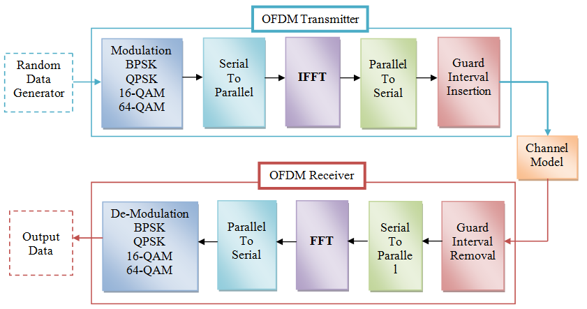

# 🛰️ OFDM_System

This repository contains a full Python implementation of an Orthogonal Frequency-Division Multiplexing (OFDM) system.  
OFDM is a multicarrier modulation technique widely used in modern wireless communication systems due to its robustness to multipath fading and high spectral efficiency.

---

## 📁 Repository Contents

- `main.py` – Python script for simulating OFDM transmission and reception.
- `OFDM (Orthogonal Frequency-Division Multiplexing) Explanation.pdf` – A detailed explanation of the OFDM system and its implementation.
- `README.md` – This documentation file.

---

## 🚀 Getting Started

### Prerequisites

- Python 3.x → [Download Python](https://www.python.org/downloads/)
- IDE or code editor (e.g. [VS Code](https://code.visualstudio.com/), [PyCharm](https://www.jetbrains.com/pycharm/))

### Installation

1. Clone the repository:
   ```bash
   git clone https://github.com/TomSimkin/OFDM_System.git
   ```
   
2. Navigate into the project directory:
  ```bash
  cd OFDM_System
  ```

3. (Optional) Install dependencies:
   ```bash
   pip install -r requirements.txt
   ```
   Note: Create requirements.txt if your project uses external packages.

## ▶️ Running the Simulation

   Run the main simulation script:
   ```bash
   python main.py
   ```
   The program generates .png images to visualize each processing stage of the OFDM system, such as modulation, channel simulation, and demodulation.

## 📖 Documentation

For a theoretical background and explanation of each step, refer to the included PDF:

OFDM (Orthogonal Frequency-Division Multiplexing) Explanation.pdf
   
## ✨ Features  

- Complete simulation of an OFDM communication system:

- QAM modulation/demodulation

- IFFT/FFT processing

- Cyclic prefix addition and removal

- Step-by-step visualization of signal processing

- Modular, readable code structure

## 📊 OFDM System Diagram

Below is a high-level block diagram of the OFDM transmission and reception process:


